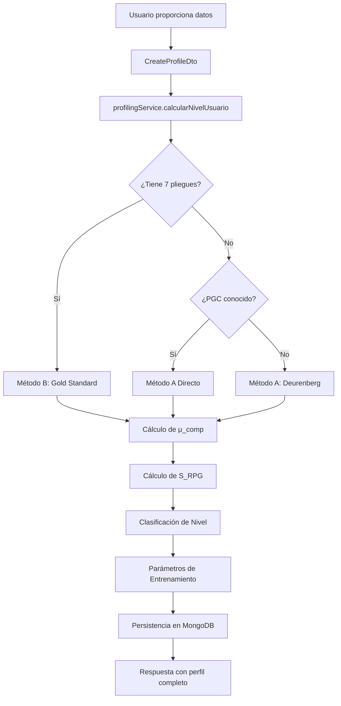

# Algoritmo de Perfilamiento RPG ($S_{RPG}$) - Microciclo

## 📋 Índice

1. [Descripción General](#descripción-general)
2. [Arquitectura del Sistema](#arquitectura-del-sistema)
3. [Metodología Científica](#metodología-científica)
4. [Implementación Técnica](#implementación-técnica)
5. [API y Uso](#api-y-uso)
6. [Ejemplos Prácticos](#ejemplos-prácticos)
7. [Referencias](#referencias)

---

## Descripción General

El **Sistema de Perfilamiento RPG** implementa un algoritmo multifactorial basado en evidencia científica para clasificar usuarios en niveles de entrenamiento (`Básico`, `Intermedio`, `Avanzado`) y determinar parámetros óptimos de carga para el diseño de microciclos.

### Objetivos del Sistema

- ✅ **Clasificación Precisa**: Determinar el nivel de entrenamiento mediante análisis multifactorial
- ✅ **Personalización**: Adaptar cargas, frecuencias y volúmenes según capacidad individual
- ✅ **Seguridad**: Prevenir sobrecarga en usuarios con patologías o bajo rendimiento
- ✅ **Escalabilidad**: Progresión gradual del perfil a medida que el usuario avanza

### Score de Capacidad ($S_{RPG}$)

El score central del sistema se calcula mediante:

$$
S_{RPG} = (P_{exp} + P_{act}) \times \mu_{comp} \times \delta_{salud}
$$

Donde:
- **$P_{exp}$**: Puntaje de Experiencia (0-60 puntos)
- **$P_{act}$**: Puntaje de Actividad OMS (0-20 puntos)
- **$\mu_{comp}$**: Multiplicador de Composición Corporal (0.8-1.2)
- **$\delta_{salud}$**: Factor de Seguridad (0 o 1)

### Clasificación de Perfiles

| Score ($S_{RPG}$) | Nivel | Descripción |
|-------------------|-------|-------------|
| 0 - 35 | **Básico** | Usuario principiante o sedentario |
| 36 - 65 | **Intermedio** | Usuario con experiencia moderada |
| > 65 | **Avanzado** | Usuario experimentado y atlético |

---

## Arquitectura del Sistema

### Componentes Principales

```
backend/src/users/
├── profiling.services.ts        # Lógica principal del algoritmo
├── dto/
│   └── create-profile.dto.ts   # Validación de datos de entrada
└── schemas/
    └── profile.schema.ts        # Modelo de persistencia MongoDB
```

### Flujo de Datos



---

## Metodología Científica

### 1. Factor de Seguridad ($\delta_{salud}$)

**Objetivo**: Proteger usuarios con condiciones médicas.

```typescript
const deltaSalud = data.condicionmedica ? 0 : 1;
```

| Condición | Valor | Efecto |
|-----------|-------|--------|
| Sin patologías | `1` | Sin penalización |
| Con patologías | `0` | Score = 0 (requiere evaluación médica) |

**Justificación**: Usuarios con patologías cardiovasculares, articulares o metabólicas requieren supervisión médica antes de iniciar programas de entrenamiento intenso.

---

### 2. Puntaje de Experiencia ($P_{exp}$)

**Objetivo**: Valorar la adaptación neuromuscular previa del usuario.

```typescript
let pExp = 0;
if (data.experienceMonths < 3) pExp = 5;
else if (data.experienceMonths < 6) pExp = 15;
else if (data.experienceMonths < 12) pExp = 30;
else if (data.experienceMonths < 24) pExp = 45;
else pExp = 60;
```

| Experiencia | Meses | Puntaje | Adaptación |
|-------------|-------|---------|------------|
| **Novato** | 0-3 | 5 | Fase neural inicial |
| **Principiante** | 3-6 | 15 | Aprendizaje motor |
| **Aprendiz** | 6-12 | 30 | Adaptación metabólica |
| **Competente** | 12-24 | 45 | Hipertrofia funcional |
| **Experimentado** | >24 | 60 | Capacidad máxima |

**Base Científica**:
- **0-3 meses**: Fase de adaptación neural (Kraemer & Ratamess, 2004)
- **3-12 meses**: Desarrollo de técnica y patrones motores (Folland & Williams, 2007)
- **12-24 meses**: Hipertrofia muscular significativa (Schoenfeld, 2010)
- **>24 meses**: Capacidad de tolerancia a volúmenes altos (Rhea et al., 2003)

---

### 3. Puntaje de Actividad OMS ($P_{act}$)

**Objetivo**: Evaluar el cumplimiento de las directrices de actividad física de la OMS.

```typescript
let pAct = 0;
switch (data.nivelactividad) {
  case NivelActividad.SEDENTARY: pAct = 0; break;
  case NivelActividad.ACTIVE: pAct = 10; break;
  case NivelActividad.SPORT: pAct = 20; break;
}
```

| Nivel | Descripción | Puntaje |
|-------|-------------|---------|
| **SEDENTARY** | <150 min/semana de actividad moderada | 0 |
| **ACTIVE** | ≥150 min/semana (cumple OMS) | 10 |
| **SPORT** | ≥300 min/semana + entrenamiento | 20 |

**Referencia OMS**: La OMS recomienda 150-300 minutos semanales de actividad aeróbica moderada o 75-150 minutos de actividad vigorosa (WHO, 2020).

---

### 4. Composición Corporal (PGC)

El sistema implementa **3 métodos** de cálculo del Porcentaje de Grasa Corporal (PGC):

#### Método A: Estimación Deurenberg (por defecto)

```typescript
const imc = data.weight / (data.height * data.height);
pgc = (1.20 * imc) + (0.23 * data.age) - (10.8 * data.gender) - 5.4;
```

**Fórmula**:
$$
PGC = 1.20 \times IMC + 0.23 \times \text{edad} - 10.8 \times \text{género} - 5.4
$$

Donde:
- **género** = 1 (hombre), 0 (mujer)
- **IMC** = peso (kg) / altura² (m²)

**Aplicación**: Cuando no hay datos antropométricos precisos.

---

#### Método A Directo: Valor Proporcionado

```typescript
if (data.knownBodyFat) {
    pgc = data.knownBodyFat;
    metodoUtilizado = 'Valor Proporcionado';
}
```

**Aplicación**: El usuario proporciona un PGC medido por DEXA, bioimpedancia profesional o hidrostática.

---

#### Método B: 7 Pliegues Cutáneos (Gold Standard)

**Ecuación de Jackson & Pollock + Fórmula de Siri**

##### Paso 1: Suma de 7 pliegues

$$
\Sigma_7 = P_{tri} + P_{del} + P_{pec} + P_{cin} + P_{glu} + P_{cua} + P_{gem}
$$

```typescript
const suma7 = 
    data.pliegue_triceps! +
    data.pliegue_deltoides! +
    data.pliegue_pectoral! +
    data.pliegue_cintura! +
    data.pliegue_gluteo! +
    data.pliegue_cuadriceps! +
    data.pliegue_gastronemio!;
```

##### Paso 2: Cálculo de Densidad Corporal (D)

**Hombres**:
$$
D = 1.112 - (0.00043499 \times \Sigma_7) + (0.00000055 \times \Sigma_7^2) - (0.00028826 \times \text{edad})
$$

**Mujeres**:
$$
D = 1.097 - (0.00046971 \times \Sigma_7) + (0.00000056 \times \Sigma_7^2) - (0.00012828 \times \text{edad})
$$

```typescript
if (genero === Genero.Male) {
    densidad = 1.112 - (0.00043499 * suma7) + (0.00000055 * suma7 * suma7) - (0.00028826 * edad);
} else {
    densidad = 1.097 - (0.00046971 * suma7) + (0.00000056 * suma7 * suma7) - (0.00012828 * edad);
}
```

##### Paso 3: Ecuación de Siri

$$
PGC = \frac{495}{D} - 450
$$

```typescript
const pgc = (495 / densidad) - 450;
return Math.max(0, Math.min(pgc, 60)); // Limitado entre 0-60%
```

**Sitios de Medición**:

| Pliegue | Ubicación | Variable |
|---------|-----------|----------|
| **Tríceps** | Punto medio brazo posterior | `pliegue_triceps` |
| **Deltoides** | Punto clavicular | `pliegue_deltoides` |
| **Pectoral** | Diagonal entre axila y pezón | `pliegue_pectoral` |
| **Cintura** | Lateral al ombligo | `pliegue_cintura` |
| **Glúteo** | Línea ilíaca superior | `pliegue_gluteo` |
| **Cuádriceps** | Vasto externo | `pliegue_cuadriceps` |
| **Gastrocnemio** | Gemelar medial | `pliegue_gastronemio` |

**Referencia**: Jackson & Pollock (1985), "Practical Assessment of Body Composition".

---

### 5. Multiplicador de Composición ($\mu_{comp}$)

**Objetivo**: Ajustar el score según la composición corporal y estado físico.

```typescript
private getCompositionMultiplier(pgc: number, gender: Genero, weight: number, height: number): number {
    const imc = weight / (height * height);

    // Caso Especial: Bajo Peso Crítico
    if (imc < 18.5) return 0.90;

    if (gender === Genero.Male) {
        if (pgc < 13) return 1.20;       // Muy Definido (+20%)
        if (pgc <= 17) return 1.10;      // Atlético (+10%)
        if (pgc <= 24) return 1.00;      // Saludable (Neutro)
        if (pgc <= 29) return 0.90;      // Sobrepeso (-10%)
        return 0.80;                     // Obesidad ≥30% (-20%)
    } else {
        if (pgc < 20) return 1.20;       // Muy Definido (+20%)
        if (pgc <= 24) return 1.10;      // Atlético (+10%)
        if (pgc <= 31) return 1.00;      // Saludable (Neutro)
        if (pgc <= 37) return 0.90;      // Sobrepeso (-10%)
        return 0.80;                     // Obesidad ≥38% (-20%)
    }
}
```

#### Matriz de Ajuste - Hombres

| PGC | Clasificación | Multiplicador | Efecto |
|-----|---------------|---------------|--------|
| <13% | Muy Definido | 1.20 | Bonus atlético |
| 13-17% | Atlético | 1.10 | Bonus moderado |
| 18-24% | Saludable | 1.00 | Neutro |
| 25-29% | Sobrepeso | 0.90 | Penalización leve |
| ≥30% | Obesidad | 0.80 | Penalización (protección articular) |

#### Matriz de Ajuste - Mujeres

| PGC | Clasificación | Multiplicador | Efecto |
|-----|---------------|---------------|--------|
| <20% | Muy Definido | 1.20 | Bonus atlético |
| 20-24% | Atlético | 1.10 | Bonus moderado |
| 25-31% | Saludable | 1.00 | Neutro |
| 32-37% | Sobrepeso | 0.90 | Penalización leve |
| ≥38% | Obesidad | 0.80 | Penalización (protección articular) |

#### Excepción: Bajo Peso (IMC < 18.5)

```typescript
if (imc < 18.5) return 0.90;
```

**Justificación**: Los usuarios con bajo peso crítico presentan menor masa muscular y capacidad de recuperación, independientemente de su PGC bajo. La penalización protege contra sobrecarga en tejidos frágiles.

---

### 6. Parámetros de Entrenamiento por Perfil

Basados en la clasificación final, el sistema asigna parámetros de carga personalizados:

```typescript
private getParametrosPorPerfil(level: string): PerfilParametros {
    switch (level) {
        case 'Básico':
            return {
                frecuenciaSemanal: { min: 2, max: 3 },
                rirTarget: { min: 3, max: 3 },
                cargaEstimada: { min: 70, max: 75 },
            };
        
        case 'Intermedio':
            return {
                frecuenciaSemanal: { min: 3, max: 4 },
                rirTarget: { min: 2, max: 2 },
                cargaEstimada: { min: 75, max: 80 },
            };
        
        case 'Avanzado':
            return {
                frecuenciaSemanal: { min: 4, max: 5 },
                rirTarget: { min: 0, max: 1 },
                cargaEstimada: { min: 85, max: 90 },
            };
    }
}
```

#### Tabla Comparativa de Parámetros

| Parámetro | Básico | Intermedio | Avanzado |
|-----------|--------|------------|----------|
| **Frecuencia Semanal** | 2-3 días | 3-4 días | 4-5 días |
| **RIR (Reps en Reserva)** | 3 | 2 | 0-1 |
| **Carga Estimada (%1RM)** | 70-75% | 75-80% | 85-90% |
| **Proximidad al Fallo** | Lejos | Moderada | Muy cerca/al fallo |

**RIR (Reps in Reserve)**:
- **RIR 3**: El usuario podría hacer 3 repeticiones más antes del fallo
- **RIR 2**: 2 repeticiones en reserva
- **RIR 0-1**: Al fallo técnico o muy cerca

**Base Científica**:
- Frecuencia: ACSM Guidelines (Garber et al., 2011)
- RIR: Helms et al. (2018) - "Rating of Perceived Exertion-Based Resistance Exercise"
- Intensidad: Kraemer et al. (2002) - "Progression Models in Resistance Training"

---

## Implementación Técnica

### Estructura de Datos

#### DTO de Entrada (CreateProfileDto)

```typescript
export class CreateProfileDto {
    userId?: string;                    // Relación con User
    age: number;                        // Edad en años
    gender: Genero;                     // Male (1) o Female (0)
    experienceMonths: number;           // Meses de experiencia
    weight: number;                     // Peso en kg
    height: number;                     // Altura en metros
    nivelactividad: NivelActividad;     // sedentary | active | sport
    condicionmedica: boolean;           // ¿Tiene patologías?
    knownBodyFat?: number;              // PGC conocido (opcional)
    
    // Método B: 7 Pliegues (todos en mm)
    pliegue_triceps?: number;
    pliegue_deltoides?: number;
    pliegue_pectoral?: number;
    pliegue_cintura?: number;
    pliegue_gluteo?: number;
    pliegue_cuadriceps?: number;
    pliegue_gastronemio?: number;
}
```

#### Schema de MongoDB (Profile)

```typescript
@Schema({ timestamps: true })
export class Profile {
    // Relación con User
    @Prop({ type: Types.ObjectId, ref: 'User' })
    userId?: Types.ObjectId;

    // Datos de entrada
    age: number;
    gender: number;
    experienceMonths: number;
    weight: number;
    height: number;
    nivelactividad: string;
    condicionmedica: boolean;
    knownBodyFat?: number;
    pliegues?: { /* objeto con 7 pliegues */ };

    // Resultados calculados
    sRpg: number;                        // Score de Capacidad
    level: string;                       // Básico | Intermedio | Avanzado
    estimatedBodyFat: number;            // PGC calculado
    compositionMultiplier: number;       // μ_comp
    metodoCalculoPGC?: string;           // Método utilizado
    puntajeExperiencia?: number;         // P_exp
    puntajeActividad?: number;           // P_act
    factorSeguridad?: number;            // δ_salud

    // Parámetros de entrenamiento
    frecuenciaSemanal?: { min: number; max: number };
    rirTarget?: { min: number; max: number };
    cargaEstimada?: { min: number; max: number };
}
```

#### Índices de Optimización

```typescript
ProfileSchema.index({ userId: 1 }, { unique: true });  // Un usuario = un perfil
ProfileSchema.index({ level: 1 });                     // Búsqueda por nivel
ProfileSchema.index({ sRpg: -1 });                     // Ordenar por score
```

---

### Servicio Principal: profilingService

#### Método Principal: `calcularNivelUsuario()`

```typescript
async calcularNivelUsuario(data: CreateProfileDto) {
    // 1. Factor de Seguridad
    const deltaSalud = data.condicionmedica ? 0 : 1;

    // 2. Puntaje de Experiencia
    let pExp = /* lógica de clasificación */;

    // 3. Puntaje de Actividad OMS
    let pAct = /* lógica switch */;

    // 4. Cálculo de PGC (múltiples métodos)
    let pgc: number;
    if (this.tiene7Pliegues(data)) {
        pgc = this.calcularPGC7Pliegues(data);
    } else if (data.knownBodyFat) {
        pgc = data.knownBodyFat;
    } else {
        pgc = /* Deurenberg */;
    }

    // 5. Multiplicador de Composición
    const muComp = this.getCompositionMultiplier(pgc, data.gender, data.weight, data.height);

    // 6. Cálculo del Score RPG
    const sRpg = (pExp + pAct) * muComp * deltaSalud;

    // 7. Clasificación
    let level = 'Básico';
    if (sRpg > 65) level = 'Avanzado';
    else if (sRpg >= 36) level = 'Intermedio';

    // 8. Parámetros de entrenamiento
    const parametrosCarga = this.getParametrosPorPerfil(level);

    // 9. Persistencia en MongoDB con relación bidireccional
    const createdProfile = await this.profileModel.create(profileData);
    
    if (data.userId) {
        await this.userModel.findByIdAndUpdate(
            data.userId,
            { profileId: createdProfile._id }
        );
    }

    return { ...result, profileId: createdProfile._id };
}
```

#### Métodos Auxiliares de Consulta

```typescript
// Obtener perfil con usuario asociado
async getProfileWithUser(profileId: string): Promise<any> {
    return this.profileModel
        .findById(profileId)
        .populate('userId', '-password')
        .exec();
}

// Obtener perfiles por nivel
async getProfilesByLevel(level: string): Promise<Profile[]> {
    return this.profileModel.find({ level }).exec();
}

// Estadísticas de perfiles
async getProfileStats(): Promise<any> {
    const total = await this.profileModel.countDocuments().exec();
    const basico = await this.profileModel.countDocuments({ level: 'Básico' }).exec();
    // ... resto de estadísticas
}
```

---

## API y Uso

### Endpoint de Creación de Perfil

**POST** `/users/profile`

#### Request Body

```json
{
  "userId": "507f1f77bcf86cd799439011",
  "age": 28,
  "gender": 1,
  "experienceMonths": 18,
  "weight": 78,
  "height": 1.75,
  "nivelactividad": "active",
  "condicionmedica": false,
  "pliegue_triceps": 12,
  "pliegue_deltoides": 10,
  "pliegue_pectoral": 8,
  "pliegue_cintura": 15,
  "pliegue_gluteo": 9,
  "pliegue_cuadriceps": 14,
  "pliegue_gastronemio": 11
}
```

#### Response

```json
{
  "sRpg": 55.2,
  "level": "Intermedio",
  "estimatedBodyFat": 14.8,
  "compositionMultiplier": 1.10,
  "metodoCalculoPGC": "7 Pliegues (Gold Standard)",
  "puntajeExperiencia": 45,
  "puntajeActividad": 10,
  "factorSeguridad": 1,
  "frecuenciaSemanal": { "min": 3, "max": 4 },
  "rirTarget": { "min": 2, "max": 2 },
  "cargaEstimada": { "min": 75, "max": 80 },
  "profileId": "507f191e810c19729de860ea",
  "userId": "507f1f77bcf86cd799439011"
}
```

---

## Ejemplos Prácticos

### Ejemplo 1: Usuario Básico Sedentario

**Input**:
```json
{
  "age": 35,
  "gender": 1,
  "experienceMonths": 2,
  "weight": 85,
  "height": 1.72,
  "nivelactividad": "sedentary",
  "condicionmedica": false
}
```

**Cálculos**:
- **$P_{exp}$** = 5 (< 3 meses)
- **$P_{act}$** = 0 (sedentario)
- **PGC** = 27.3% (Deurenberg, sobrepeso)
- **$\mu_{comp}$** = 0.90 (PGC 25-29%)
- **$\delta_{salud}$** = 1 (sin patologías)
- **$S_{RPG}$** = (5 + 0) × 0.90 × 1 = **4.5**

**Clasificación**: **Básico**

**Parámetros**:
- Frecuencia: 2-3 días/semana
- RIR: 3
- Carga: 70-75% 1RM

---

### Ejemplo 2: Usuario Intermedio Activo

**Input**:
```json
{
  "age": 26,
  "gender": 0,
  "experienceMonths": 14,
  "weight": 62,
  "height": 1.65,
  "nivelactividad": "active",
  "condicionmedica": false,
  "knownBodyFat": 23
}
```

**Cálculos**:
- **$P_{exp}$** = 45 (12-24 meses)
- **$P_{act}$** = 10 (cumple OMS)
- **PGC** = 23% (valor proporcionado)
- **$\mu_{comp}$** = 1.10 (atlética, PGC 20-24%)
- **$\delta_{salud}$** = 1
- **$S_{RPG}$** = (45 + 10) × 1.10 × 1 = **60.5**

**Clasificación**: **Intermedio**

**Parámetros**:
- Frecuencia: 3-4 días/semana
- RIR: 2
- Carga: 75-80% 1RM

---

### Ejemplo 3: Usuario Avanzado Deportista

**Input**:
```json
{
  "age": 29,
  "gender": 1,
  "experienceMonths": 36,
  "weight": 82,
  "height": 1.80,
  "nivelactividad": "sport",
  "condicionmedica": false,
  "pliegue_triceps": 8,
  "pliegue_deltoides": 7,
  "pliegue_pectoral": 6,
  "pliegue_cintura": 10,
  "pliegue_gluteo": 7,
  "pliegue_cuadriceps": 9,
  "pliegue_gastronemio": 8
}
```

**Cálculos**:
- **$P_{exp}$** = 60 (>24 meses)
- **$P_{act}$** = 20 (deportista)
- **Σ₇** = 55 mm
- **Densidad** = 1.0825 (Jackson & Pollock)
- **PGC** = 11.8% (Siri)
- **$\mu_{comp}$** = 1.20 (muy definido, PGC < 13%)
- **$\delta_{salud}$** = 1
- **$S_{RPG}$** = (60 + 20) × 1.20 × 1 = **96**

**Clasificación**: **Avanzado**

**Parámetros**:
- Frecuencia: 4-5 días/semana
- RIR: 0-1
- Carga: 85-90% 1RM

---

### Ejemplo 4: Usuario con Patología (Caso Especial)

**Input**:
```json
{
  "age": 45,
  "gender": 1,
  "experienceMonths": 12,
  "weight": 90,
  "height": 1.75,
  "nivelactividad": "active",
  "condicionmedica": true
}
```

**Cálculos**:
- **$P_{exp}$** = 30
- **$P_{act}$** = 10
- **PGC** = 28.5%
- **$\mu_{comp}$** = 0.90
- **$\delta_{salud}$** = **0** (patología presente)
- **$S_{RPG}$** = (30 + 10) × 0.90 × **0** = **0**

**Clasificación**: **Básico** (por seguridad)

**Acción Recomendada**: El usuario debe obtener autorización médica antes de iniciar entrenamientos de fuerza. El sistema le asigna perfil Básico con parámetros conservadores.

---

## Integración con Sistema de Rutinas

El perfil calculado se utiliza en otros módulos del sistema:

### 1. Generación de Microciclos

```typescript
// En rutinas.service.ts
async generateRoutine(userId: string) {
    // Obtener perfil del usuario
    const profile = await this.profilingService.getProfileWithUser(profileId);
    
    // Usar parámetros del perfil
    const rirTarget = profile.rirTarget.min;
    const cargaMin = profile.cargaEstimada.min;
    const frecuencia = profile.frecuenciaSemanal.max;
    
    // Aplicar en algoritmo de optimización
    // ...
}
```

### 2. Progresión Dinámica

El sistema puede recalcular el perfil periódicamente (cada 4-8 semanas) para ajustar parámetros según el progreso:

```typescript
// Actualizar métricas
await this.profilingService.updateProfile(profileId, {
    experienceMonths: profile.experienceMonths + 2,
    weight: nuevoPeso,
    knownBodyFat: nuevoPGC
});

// Recalcular score
const nuevoScore = await this.calcularNivelUsuario(datosActualizados);
```

---

## Validaciones y Manejo de Errores

### Validaciones de Entrada

```typescript
// En create-profile.dto.ts
export class CreateProfileDto {
    @IsNumber()
    @Min(15)
    @Max(100)
    age: number;

    @IsNumber()
    @Min(30)
    @Max(200)
    weight: number;

    @IsNumber()
    @Min(1.20)
    @Max(2.50)
    height: number;

    @IsNumber()
    @Min(0)
    experienceMonths: number;

    // Validaciones para pliegues (0-50 mm típico)
    @IsOptional()
    @IsNumber()
    @Min(0)
    @Max(100)
    pliegue_triceps?: number;
}
```

### Casos Límite

```typescript
// Protección contra valores extremos
const pgc = Math.max(0, Math.min(calculatedPGC, 60)); // 0-60%

// Verificación de IMC bajo peso
if (imc < 18.5) return 0.90; // Penalización por fragilidad
```

---

## Referencias Científicas

1. **Deurenberg, P., et al. (1991)** - "Body mass index as a measure of body fatness: age- and sex-specific prediction formulas"
   - *British Journal of Nutrition*, 65(2), 105-114.

2. **Jackson, A.S., & Pollock, M.L. (1985)** - "Practical Assessment of Body Composition"
   - *Physician and Sports Medicine*, 13(5), 76-90.

3. **Siri, W.E. (1961)** - "Body composition from fluid spaces and density"
   - *Techniques for Measuring Body Composition*, 223-244.

4. **Kraemer, W.J., et al. (2002)** - "Progression models in resistance training for healthy adults"
   - *Medicine & Science in Sports & Exercise*, 34(2), 364-380.

5. **Helms, E.R., et al. (2018)** - "Rating of Perceived Exertion-Based Resistance Exercise Intensity"
   - *Sports Medicine*, 48(3), 697-707.

6. **Schoenfeld, B.J. (2010)** - "The mechanisms of muscle hypertrophy and their application to resistance training"
   - *Journal of Strength and Conditioning Research*, 24(10), 2857-2872.

7. **WHO (2020)** - "WHO guidelines on physical activity and sedentary behaviour"
   - World Health Organization.

8. **ACSM (2011)** - Garber, C.E., et al., "Quantity and Quality of Exercise for Developing and Maintaining Cardiorespiratory, Musculoskeletal, and Neuromotor Fitness in Apparently Healthy Adults"
   - *Medicine & Science in Sports & Exercise*, 43(7), 1334-1359.

---

## Conclusión

El **Algoritmo de Perfilamiento RPG** es un sistema robusto y científicamente fundamentado que:

✅ **Clasifica usuarios** en 3 niveles con alta precisión  
✅ **Personaliza parámetros** de carga, frecuencia e intensidad  
✅ **Protege la seguridad** mediante factores de corrección  
✅ **Escala progresivamente** con actualización periódica  
✅ **Integra múltiples métodos** de evaluación corporal  

Este sistema constituye la base para la generación de microciclos personalizados y optimizados, garantizando resultados efectivos y seguros para todos los usuarios del sistema Muscle-RPG.

---

**Versión**: 1.0  
**Última Actualización**: 12 de diciembre de 2025  
**Autor**: Equipo Muscle-RPG  
**Contacto**: [GitHub Repository](https://github.com/fase99/Muscle-RPG)
